# 1950年世界各地城市 AMS地图
## 介绍
爬取和简单截图对建国前与初期国内外代表城市的建成区对比。

## 数据源

最初在wiki百科武汉看到的AMS地图，今天搜索数据源发现在
http://legacy.lib.utexas.edu/maps/ams/

该数据是德州大学图书馆线上开放的美军在二战到冷战开始时（1950年前后）绘制的全球各地图影印版，为航拍测绘1:25万高精度地图。
- 所有地图均为同比例尺
- 各地区用同规格的大方格划分（貌似是150公里 x 120公里）
 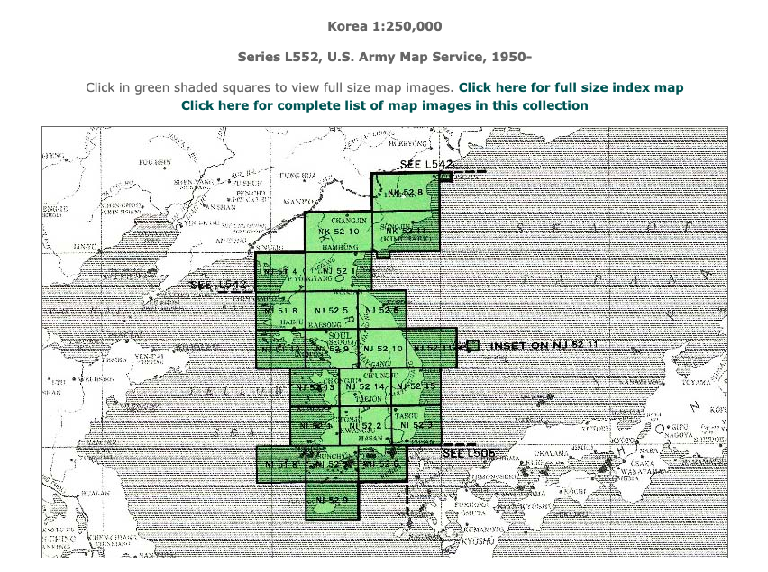

- 地名采用英文名和当地语言标示
- 大方格对应地图用10公里x10公里小方格划分
- 建成区为黄色标示
 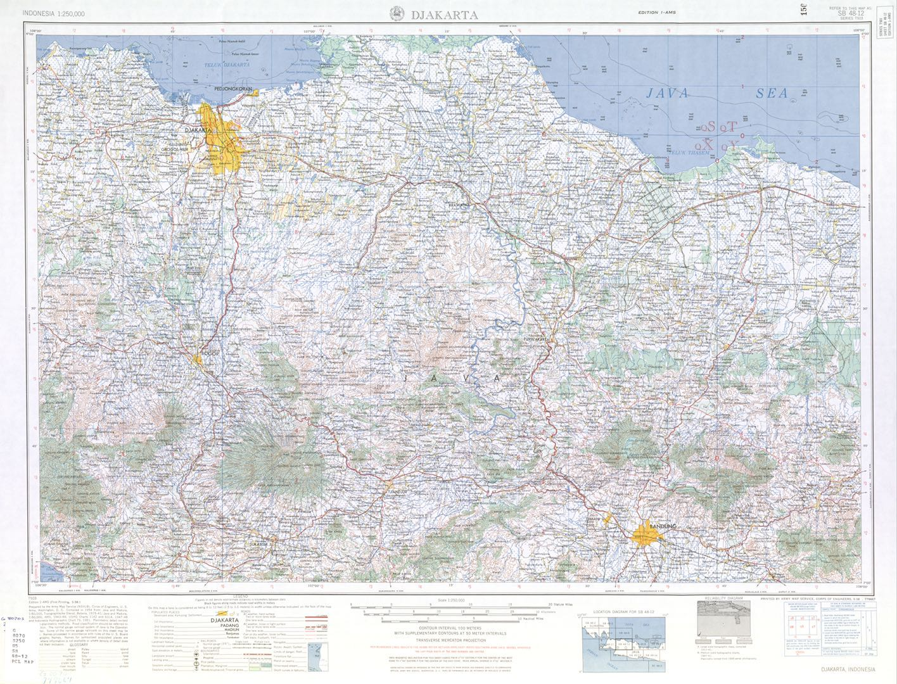

中国日本韩国有汉字标示，不过链接名是表音：
 - 中国采用威玛氏拼音比较难，例如厦门为Hsia-Men，又称Amoy， 基本都是这种， 我只能通过坐标和城市轮廓推断。。。 
 - 日本假名和韩国谚文与今天几乎无异。尤其是日本，和今天一模一样

#### 城市
美国人选取了他们认为重要的城市，带了vicinity地图
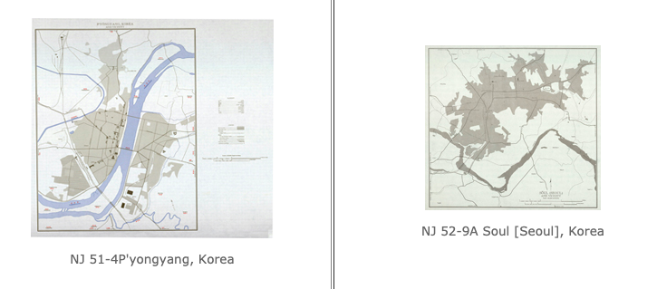

中国华北华南有21座城市入选， 基本是各省省会与租借通商口岸大城市

注意到民国时城市名及行政与今天不同，例如：
- 北京为北平， 武汉为汉口
- 河南省会为开封， 而安徽省会在安庆、芜湖、蚌埠、合肥等城市变动中，因此缺乏
- 山东有济南、烟台与青岛入榜

## 分析
编写了爬取脚本，其中：
- get_url 

  - 采用BeautifulSoup库
  - 获取所有地区的大方格的url
  - 并对大方格包含重要城市代码（vicinity）做了标示 

- download
    - 对重要城市vicinity 地图做了多线程下载 

一共爬取了中国、印度、韩国、日本、法国、东南亚、南非约150个城市的地图。

图中每个格子都是10公里x10公里的，可以估算各大城市的面积。

### 国内典型城市的对比
中国我选取了：
- 民国最大城市上海
- 第二/三大城市清朝首都北京（北京和天津一样）
- 西方租借的沿海城市厦门
- 远离海洋内生成长的成都。

我们可以看到：
- 厦门当时建成区为今天鼓浪屿及其附近厦门岛一小块
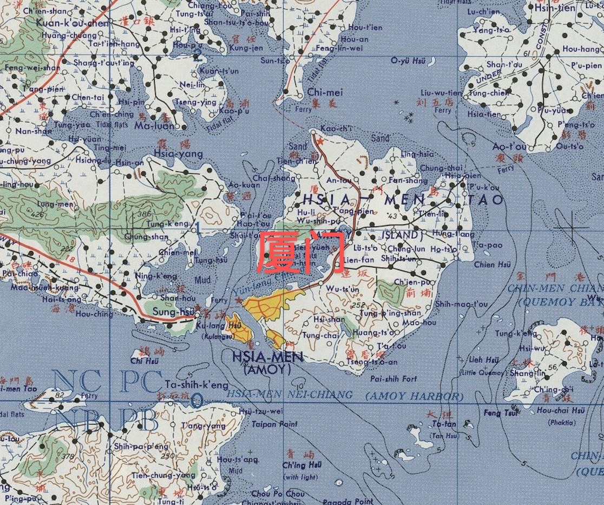
- 成都为今一环内
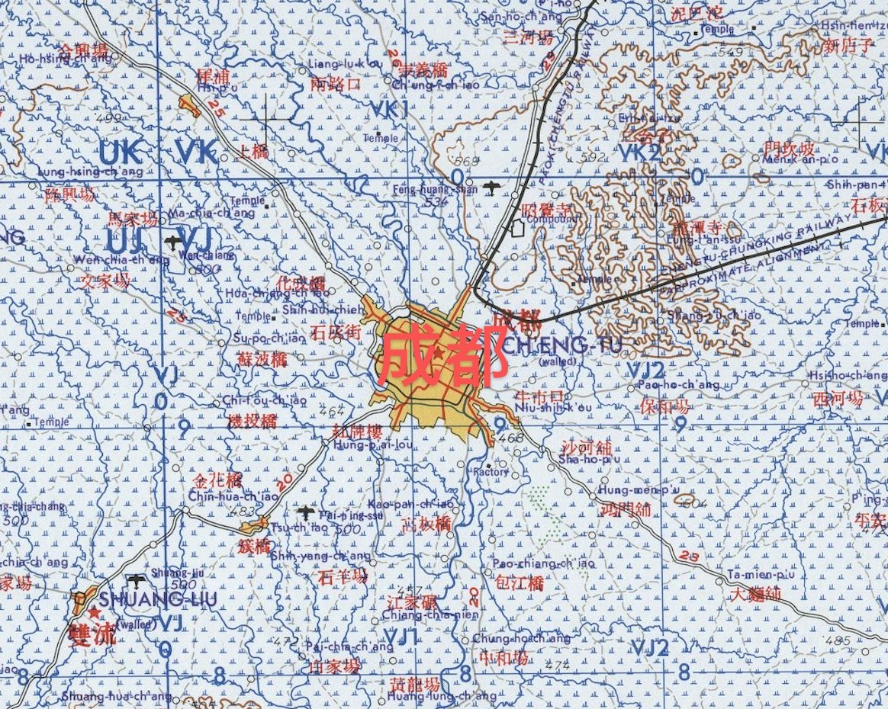
- 北京为今二环内
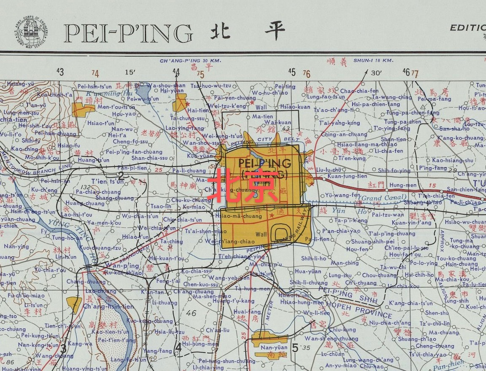
- 上海为今内环浦西
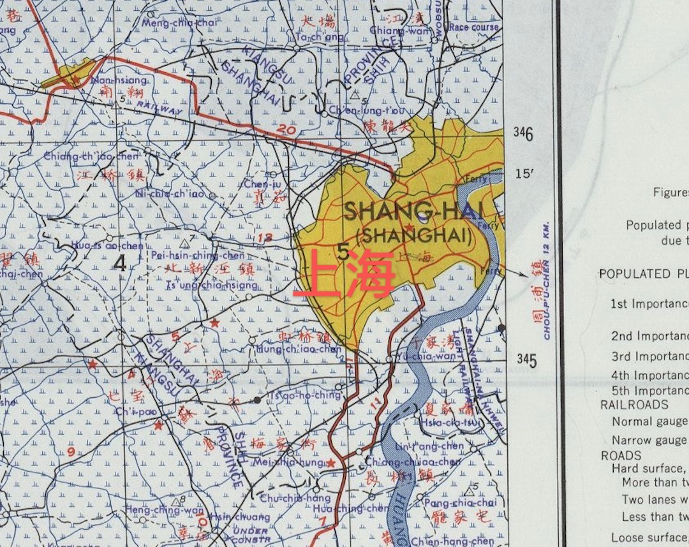

总体上， 上海相当于北京的1.5倍，成都的4倍，厦门的10倍。

### 上海与国外典型城市的对比

建国前上海固然是中国无可争议之最大城市。但建成区与其他落后国家大城市毫无优势， 更远小于当时列强国家的城市。

我们发现：
- 与越南胡志明市类似
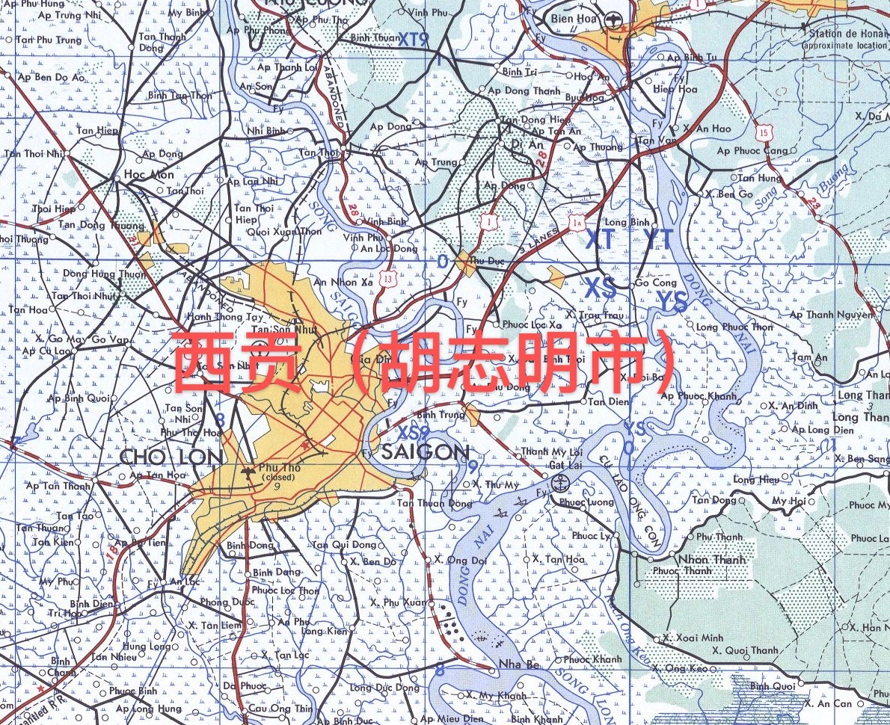
- 小于菲律宾马尼拉
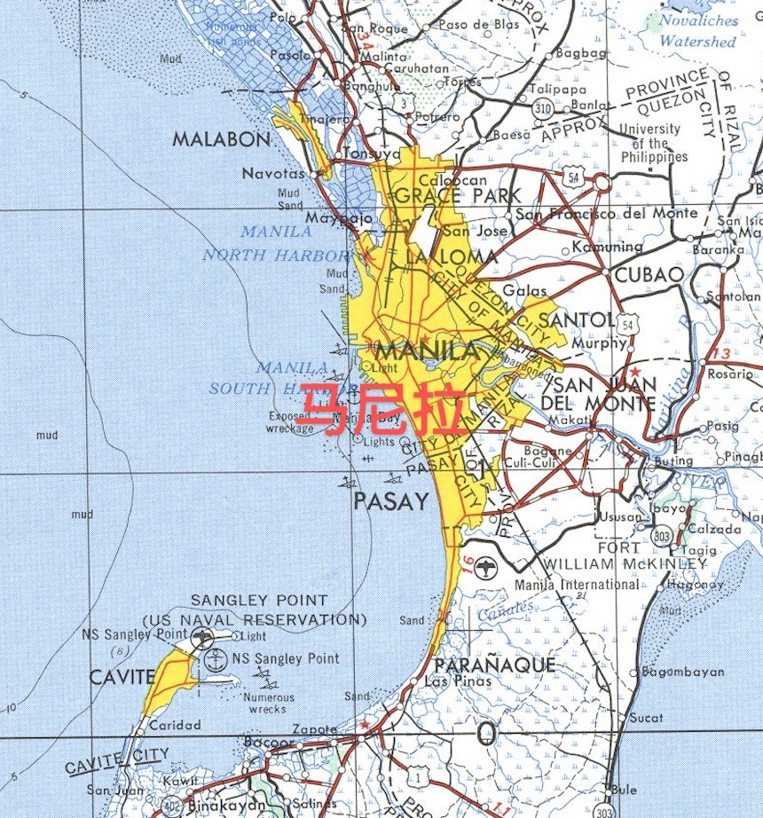
- 小于印度加尔各答， 此时印度像上海建成区规模的城市有10座， 当时孟买被称作"印度的上海"可能会不开心
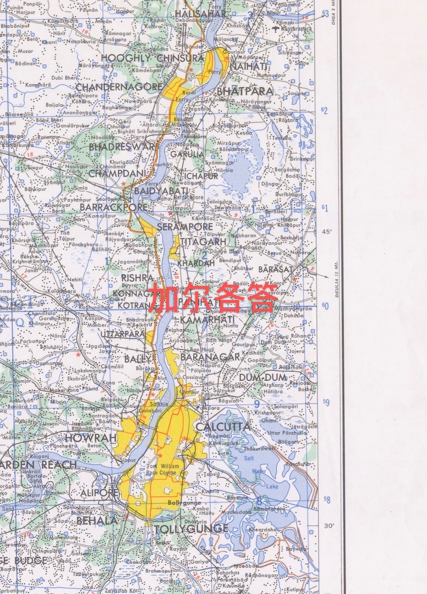

与列强对比：
- 民国上海作为"远东第一大城市"， 但建成区是抗日战争侵略者日本东京的1/8
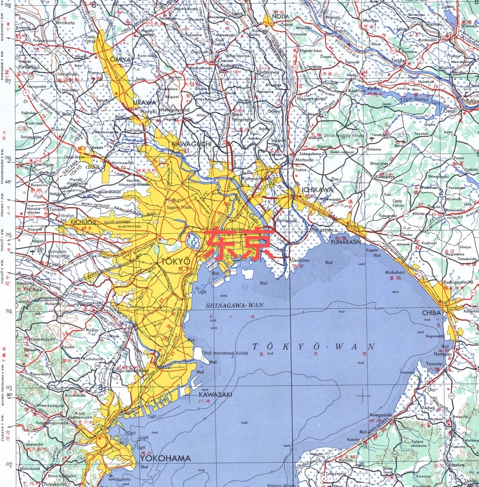
- 民国上海亦有"东方巴黎"之称，但巴黎相当于12个上海
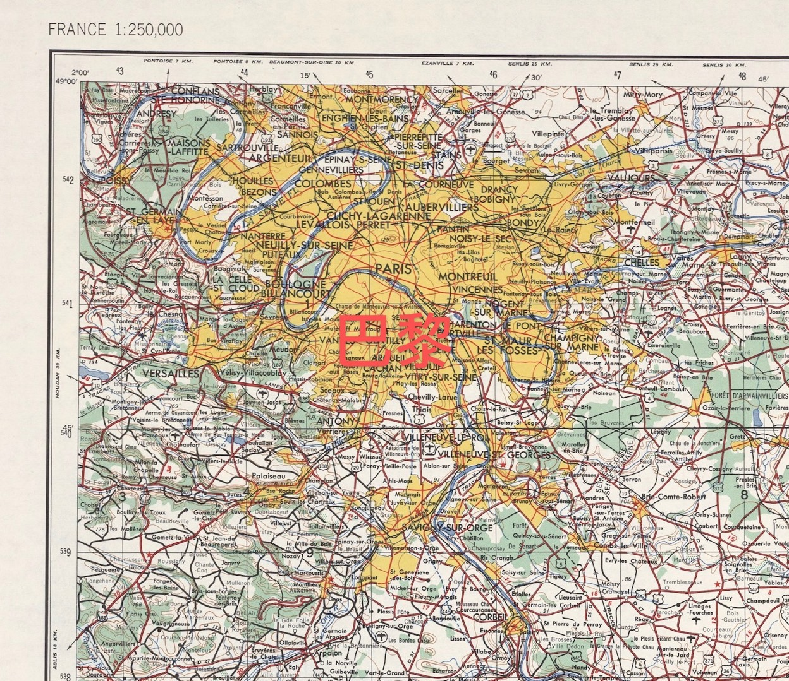

### 当时其它中国城市与列强的对比 

#### 成都
今天成都城市面积快要赶上巴黎。参考：
[2018年中国各大城市建成区面积排行榜](https://www.jianshu.com/p/e31991cfeb0e)

- 成都的建成区是1167平方公里， 今天可能超过1300平方公里了
- 成都今年亦有400公里+地铁运营。
- 无论建成区还是地铁（巴黎城铁可能长一点） 都与巴黎相差无几。

而民国时，巴黎等于50个成都。

## 注： 

1. 这些图片作为德州奥斯汀还有加州伯克利大学的资料开放，没有版权保护。

2. 在谷歌、百度、高德地图的今天，这些70年前的地图只有史料价值。

3. 私以为中国高房价的痛苦来源于剧烈的城市化，根源是解放前底子实在太差，此时的居住条件不会比一百万人/平方公里的九龙寨好太多

4. 数据源本来作为学术与兴趣资料， 不可用于political 用途， 不建议作商业用途

